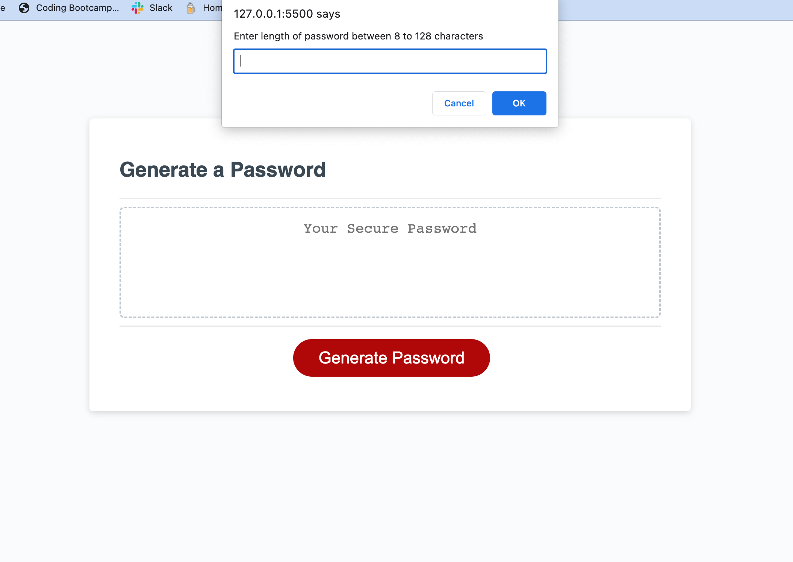

# Modified-Password-Generator

## Description

There was a starter code that was modified to create a website using Javascript to generate a password. The user is prompted on what they would like to be included in their password such as entering in the length between 8 to 128 characters, upper and lowercase letters, numbers, and special characters. As a student in coding bootcamp, it is important to become very familiar with javascript such as using functions and creating variables to be used in those functions. While careating the variables, it is also important to understand strings, boolean, numerals, etc. This application is very interactive with the user and it is required to be easy to use without any errors. 

## Installation

N/A

## Usage

The user will need to click the red "Generate Password" button to bring up the prompts that will ask how long the password should be and to include whether or not there should be upper and lowercase letters, numbers, and special characters. If the user enters in a number that is outside of the range of 8 to 128 characters, it will prompt that it must be over or under the specified range. The user will then need to click "Generate Password" again to bring back up the prompts.

## Credits

The starter code for this project was used from a repository named friendly-parakeet which can be accessed through the following link: https://github.com/coding-boot-camp/friendly-parakeet.git

## License

Please refer to LICENSE in the repository.